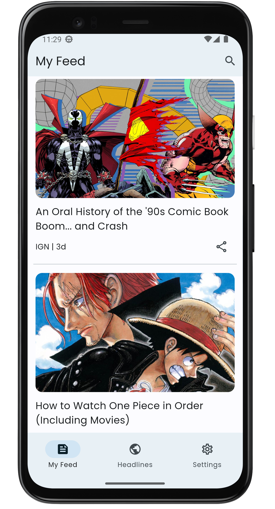

# News app


This Flutter project aims to provide users with a seamless experience to read articles from various domains of your choice. You can add their preferred domains and view articles specifically from those sources. Additionally, the application showcases top headlines by countries and categories, allowing users to stay up-to-date with the latest news globally. The app also offers a powerful search functionality, enabling users to search for any article and sort them by date, relevancy, or popularity.

## Features
- View articles from user-added domains
- Explore top headlines by countries and categories
- Powerful search feature to find specific articles
- Sort searched articles by date, relevancy, or popularity
- Dark theme support for comfortable reading in low-light conditions
- Material You support, bringing Android 12 design language and customization options

## Screenshots

<div style="display: flex; justify-content: center; align-items: center;">
  

  
</div>

## Getting Started

### Prerequisites

- Flutter SDK: [Installation Guide](https://flutter.dev/docs/get-started/install)

### Installation

1. Clone the repository:

    ```shell
    git clone https://github.com/Endeavor36/news_app.git

2. Navigate to the project directory:

    ```shell
    cd news_app

3. Install the dependencies:

    ```shell
    flutter pub get

4. Generate the providers using riverpod generator

    ```shell
    dart run build_runner watch -d

5. Before running, you will have to add your own api key. Get your API key from [here](https://newsapi.org/).

## Usage
Upon launching the application, you will be presented with the feed screen, you will have to add some sources first to view articles. Clicking on any article will open it in your default web browser.

### Adding Domains
To add domains of your interest, follow these steps:
1. Open the settings page from the app's menu.
2. Navigate to the "Manage Sources" section.
3. Add your preferred domains one by one.

### Searching Articles
To search for articles, use the search bar on the top of the home screen. Enter your search query and press enter to see relevant articles. You can also sort the search results by date, relevancy, or popularity.

## Material You Support
This app embraces the Material You design language introduced in Android 12. It allows the app's appearance to be customized based on system-wide themes and color schemes, providing a more personalized user experience.

## Which domains to add?
Not every domain will work. Only supported domains work. Any domain you see in top headlines or search will work. So add it in 'My sources' and refresh your feed.

## Contributing
Contributions are welcome. If you find any bugs, have suggestions for new features, or would like to improve the code, please feel free to open an issue or submit a pull request.
